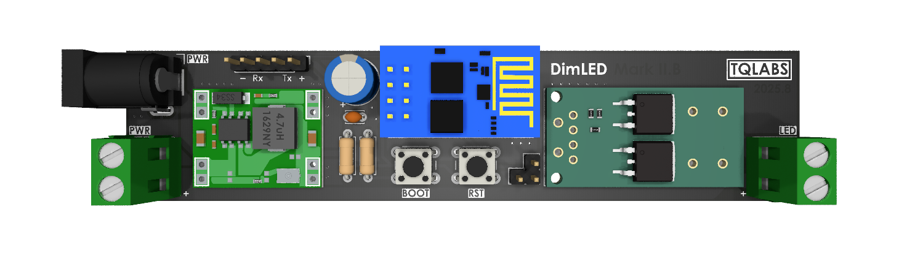
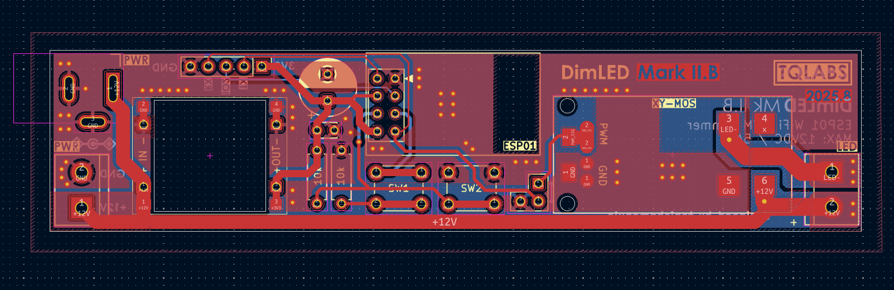

# DimLED Mark II

A simple led dimmer based on ESP-01 Module powered by esphome firmware.

Checkout [iBOM](https://htmlpreview.github.io/?https://raw.githubusercontent.com/tqlabs-in/dimled-mark-2/main/output/bom/ibom.html) for more details.

### Renders ( Mark II.b )

### Operating Power

Max Values:

- Max Voltage: 36VDC
- Max Current: 15A
- Max Power: 400W

> Above specs are contstrained by XY-MOS PWM Trigger Module

Recommended Values:

- less than 10A at 12VDC
- less than 6A at 24VDC
